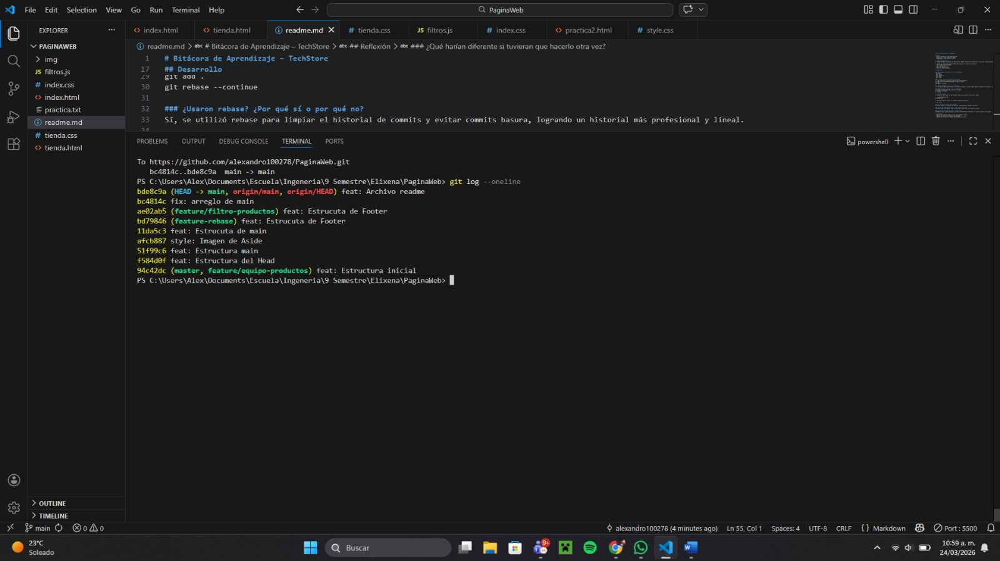
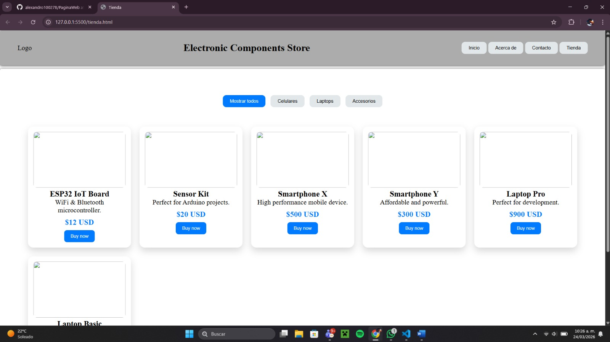
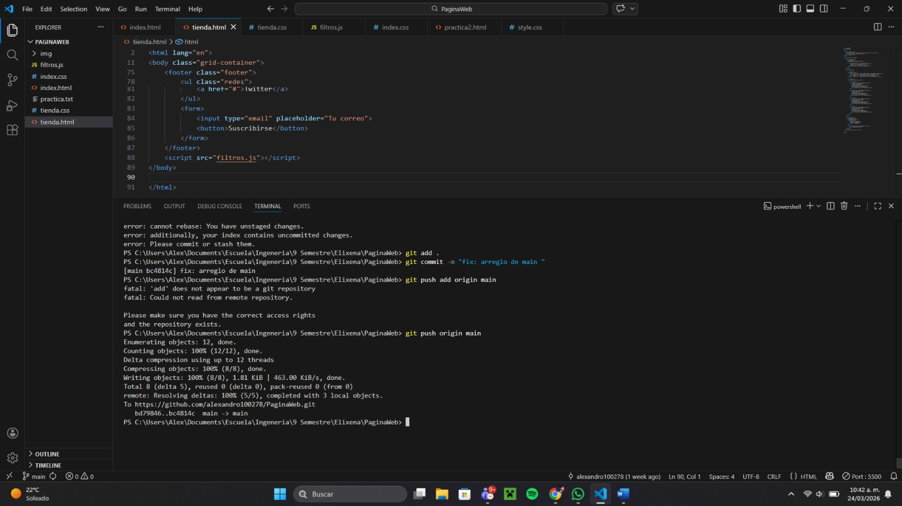

# Bitácora de Aprendizaje – TechStore

## Equipo
- Brayan Acosta - JavaScript (lógica de filtrado)
- Cristal quirino - HTML (estructura DOM)

## Planificación Inicial
Se decidió trabajar utilizando una rama feature llamada "feature/filtro-productos" para aislar el desarrollo de la nueva funcionalidad.

Se acordó el uso de Conventional Commits para mantener un historial profesional:
- feat: nuevas funcionalidades
- fix: correcciones
- style: estilos visuales
- refactor: mejoras internas

## Desarrollo

### ¿Qué comandos de Git usaron con más frecuencia?
- git add .
- git commit
- git checkout -b
- git rebase
- git merge

### ¿Tuvieron conflictos? ¿Cómo los resolvieron?
Sí, hubo conflictos al modificar estilos CSS simultáneamente.
Se resolvieron manualmente editando el código y usando:
git add .
git rebase --continue

### ¿Usaron rebase? ¿Por qué sí o por qué no?
Sí, se utilizó rebase para limpiar el historial de commits y evitar commits basura, logrando un historial más profesional y lineal.

### ¿Alguien perdió trabajo? ¿Cómo lo recuperaron?
Se simuló la pérdida de cambios durante el rebase.
Se recuperó utilizando:
git reflog

## Integración Final
Se integró la rama feature a main mediante rebase para mantener un historial limpio.

El comando utilizado fue:
git rebase main

El historial final es lineal, sin commits de merge innecesarios.

## Reflexión

### ¿Qué fue lo más difícil del proceso?
El uso de rebase y la limpieza del historial, especialmente al manejar conflictos.

### ¿Qué harían diferente si tuvieran que hacerlo otra vez?
Planificar mejor los commits desde el inicio para evitar tener que limpiarlos después.

### ¿Qué aprendieron sobre Git que no sabían antes?
Aprendimos a usar rebase interactivo, reflog y la importancia de mantener un historial limpio y profesional.

## Evidencias
- Captura del historial limpio con git log --oneline --graph

- Captura del filtro funcionando en el navegador

- Captura del historial con commits basura antes del rebase
